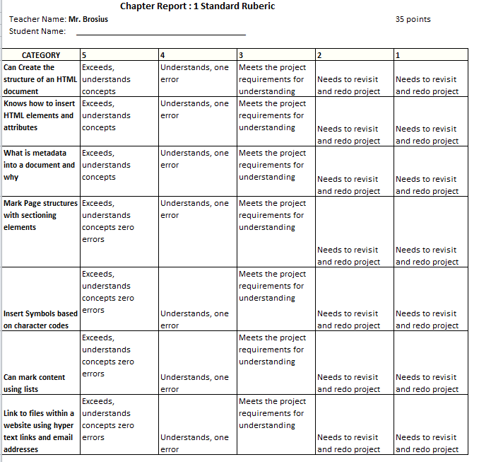

# Module 2 Fundamentals of Web Design
<b><u>Objectives</u></b>

&#9658;Explore the history of the web

&#9658;Create the structure of an HTML document

&#9658;Insert HTML elements and attributes

&#9658;Insert metadata into a document

&#9658;Define a page title

&#9658;Mark page structures with sectioning elements

&#9658;Organize page content with grouping elements

&#9658;Mark content with text-level elements

&#9658;Insert inline images

&#9658;Insert symbols based on character codes

&#9658;Mark content using lists

&#9658;Create a navigation list

&#9658;Link to files within a website with hypertext links

&#9658;Link to e-mail addresses and telephone numbers

